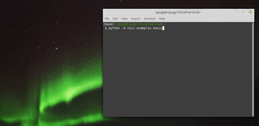

# Reiz

pyReiz is a low-level auditory and visual stimulus presentation suite wrapping pyglet, sending markers via a pylsl outlet. You can also read more [extensive documentation online](https://reiz.agricolab.de/index.html).

[](https://doi.org/10.5281/zenodo.3551933) [](https://en.wikipedia.org/wiki/MIT_License) [](https://badge.fury.io/py/Reiz) [](https://travis-ci.com/pyreiz/pyreiz) [](https://coveralls.io/github/pyreiz/pyreiz?branch=master) 

## Installation

The [requirements](#requirements) for pyReiz are _pyglet_ and _pylsl_. They are checked, and if necessary installed, during `pip install`. There is also a dependency on _pyttsx3_ to allow on-demand synthesis of auditory cues from text. If you don't need that or can't acquire a version of pyttsx3 for your architecture, install pyreiz without the `[tts]` suffix.

### Windows

```bash
pip install Reiz[tts]
```

### Linux

The most recent version of pylsl is not yet on pypi. A solution is to install libsl manually. You download a recent build of liblsl from <https://github.com/sccn/liblsl/releases>. Afterwards, install pylsl directly from github.

```bash
pip install git+https://github.com/labstreaminglayer/liblsl-Python.git
pip install Reiz[tts]
```

### Mac

Mac is currently not supported.

### Development

```bash
git clone https://github.com/pyreiz/pyreiz.git
cd pyreiz
pip install -e .[tts]
```

### Test your installation

After you installed Reiz, you can give it a test-run by calling `python -m reiz.examples.basic` from your terminal. This should start a throwaway MarkerServer, and present a series of visual and auditory stimuli. If anything does not work out, [inform us of the issue](https://github.com/pyreiz/pyreiz/issues).

## Additional Information

### Create your own experiment

Examples can be found in `reiz/examples`. A quite extensively documented basic example can be found here: [basic example](/reiz/examples/basic.py).

### Recording

Because all markers are send via LSL, i suggest recording with [Labrecorder](https://github.com/labstreaminglayer/App-LabRecorder/releases). Use at least 1.13, as this version supports BIDS-conform recording, offers a remote interface and has a critical timing bugfix included.

### Requirements

The key requirements for pyReiz are pyglet and pylsl. We require pylsl>=1.13 because a timing issue was fixed in that version (see <https://github.com/sccn/liblsl/issues/8>), and pyglet>1.4 because there was a breaking change between 1.3 and 1.4 in the way audio was generated and played (see <https://github.com/pyreiz/pyreiz/issues/2>). For text-to-speech, which is included with `[tts]`, a key requirement is _pyttsx3_.

### Acknowledgments

I adapted code from [Cocos2d](https://github.com/los-cocos/cocos) for generation of some openGL primitives.
